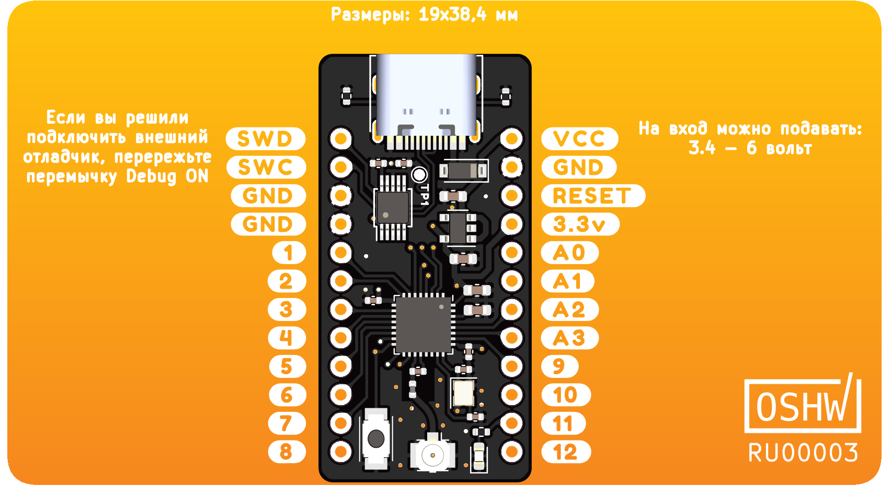

# Знакомство с crabik

Данное руководсво написано для платы crabik, поэтому самое время изучить подробнее саму плату.

Cхема распиновки платы:

Плата питается от USB-C или от напряжения поданого на вход контакта `VCC`.
Контакт `3.3v` при отсутствии какого либо напряжения может принимать 3.3 вольта, либо если плата запитана от какого либо источника, выдает 3.3 вольта.
Максимально допустимый ток от контакта `3.3v` - 400mA.

Мозгом платы является микроконтроллер [nRF52810][chip] компании Nordic Semiconductor.
Внутри него ядро Arm Cortex-M4, работающее на частоте 64Mhz.

Периферия может быть настроена на любой вывод микроконтроллера, исключением является `ADC`, входом которого могут быть только пины с `A0` по `A3`.

Светодиод на плате подключен к выводу `11`. Кнопка рядом с выводами `7` и `8`, это Reset (сброс микроконтроллера).

Для загрузки программы на микроконтроллер используется отдельная микросхема отладки совместимая с протоколом CMSIS-DAP v1.
При использовании внешнего отладчика, отключите внутренний, перерезав перемычку `Debug ON`.
Для востановления работы внутреннего отладчика, запаяйте перемычку.
Так же для меньшего потребления в режиме сна, рекомендуется отключать внешний отладчик.

## Файлы дизайна
- [Схема](https://crabik.ru/_assets/crabik-schematic-revB.pdf ':ignore :target=_blank')  
- [Интерактивный BOM](https://crabik.ru/ibom.html)
- [Файлы KiCad](https://github.com/CrabikBoards/hardware)

[chip]: https://www.nordicsemi.com/Products/Low-power-short-range-wireless/nRF52810